# Final Report

[TOC]

==此项目在 GitHub 同步==：https://github.com/login-invalid/RL_Introduction_FinalProject

## 1. 问题重述(Windy Gridworld)

下图是一个标准的网格世界，有开始和目标状态，但有一个差异：在网格中间有一个向上运行的侧风。 动作是标准的四个── 上，下，右和左，但在中间区域，结果的下一个状态向上移动一个“风”，其强度因列而异。在每列下方给出风的强度，向上移动的格子数量。

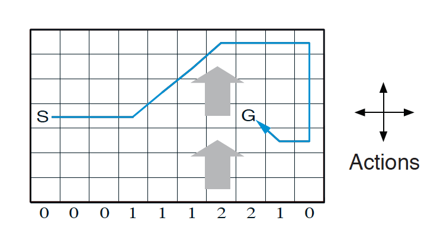

* 例如，如果你是目标右侧的一个单元格，则左侧的操作会将你带到目标上方的单元格。这是一个没有折扣的回合任务，在达到目标状态之前回报恒定为 −1。

* 问题：自行增加网格规模（如 $20\times 20$ ），自行增加障碍（必须），重新设定风向和强度（可增加随机性），并设计两种强化学习算法求解该问题，比较不同算法，提供源代码。


## 2. 环境设计

### 2.1 使用说明

我们利用 `pygame` 库完成了可交互式的网格世界构建和训练过程的可视化呈现。用户可以通过如下方式实例化一个网格世界：

```python
# world height
HEIGHT = 20

# world width
WIDTH = 20

# wind strength for each column
WIND = np.random.choice(4,WIDTH) -2 # 当风的强度小于0时候表示反向风
#WIND = [0, 0, 0, 1, 1, 1, 2, 2, 1, 0] # most trival case
print(f"Wind strength for each column is:\n{[str(w) for w in WIND]}")

# 环境编号: 路径 = -1 / 墙体 = -10 / 起点 = 0 / 终点 = 10 / 预留可视化 = 2
world = enviroment_gen(HEIGHT,WIDTH,WIND,is_random = False)
```

环境对象 `enviroment_gen` 的参数含义如下：如果需要随机风向，可以将 `is_random` 设定为 `True`

```
Generate a simulating environment.

:param height: Maze Height;
:param width: Maze WIDTH;
:param wind: Winds list along the columns, hence its length should be WIDTH;
:param is_random: whether the wind is random;
```


### 2.2 特色

针对于本问题，我们的环境设计有如下特色:

1. 风向强度可以被设定为负数，此时表示风从反方向吹来（从上往下）；
2. 风向强度可以被设定为随机生成的，此时每次风向强度将会从 $\{-1,0,1\}$ 中随机取值；
3. 你可以通过交互式界面方便的设计自己需要的环境 （包括起点 `START`，终点 `GOAL` 以及障碍物 `WALLS`）；
4. 障碍物 `WALLS` 建立后，我们考虑了移动时同时收到风向和障碍物的影响以保证我们的环境贴近真实物理世界；

例如，我们可以构建如下环境（$20\times 20$ ）的环境：

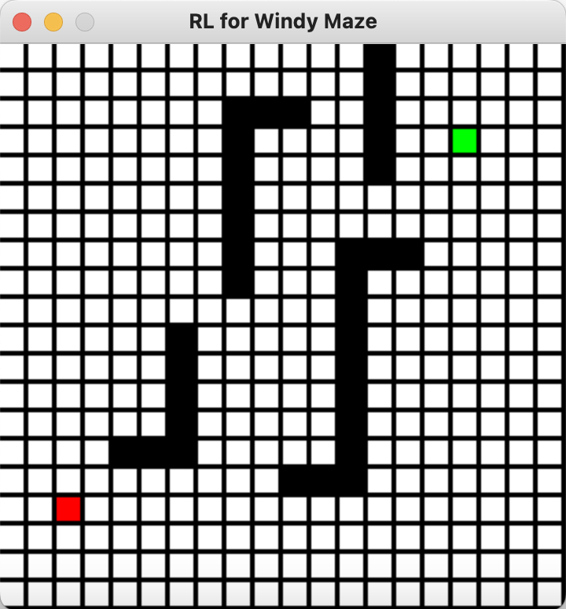

* 障碍物 `WALLS` 由黑色方块表示；

* 起点 `START` 和终点 `GOAL` 分别用红色和绿色方块表示；

* 此时的风向 `WIND` 设定为：

  ```python
  Wind strength for each column is:
  ['0', '-1', '0', '0', '-3', '0', '-2', '-1', '1', '-2', 
   					  '-2', '-1', '-2', '1', '0', '0', '-1', '0', '0', '-1']
  ```

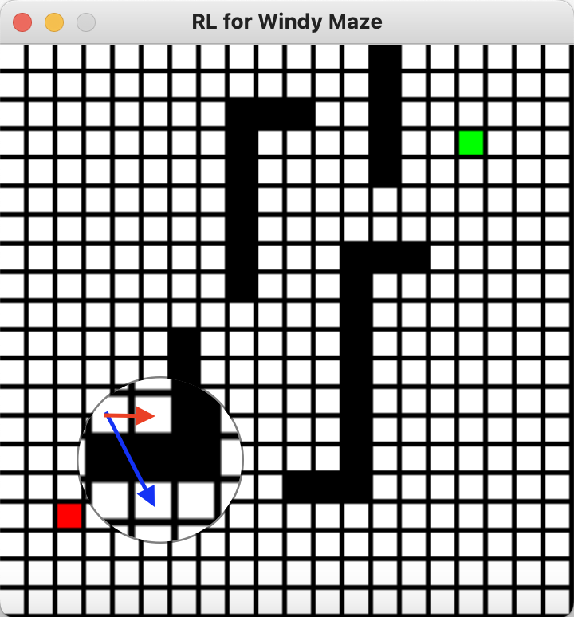

如图所示，我们考虑在从左往右的第5列的某一行出发向右行动一格。此时移动会受到第5格的风向影响（$-2$，从上向下的纵向风），因此在假设没有任何障碍物的情况下，我们应该按照蓝色有向箭头向右下角运动。但是由于障碍物的存在，实际上我们会被障碍物（墙体）阻挡并只能向右行动一格。


## 3. 算法设计

* 在这里，我们一共实现了四种强化学习的经典算法：SARSA，Q-learning，Expect-SARSA，以及 SARSA-lambda；
* 为完整性起见，我们在本章节用伪代码的形式简述各个算法；
* 注意，在我们的简化问题中，$\gamma\equiv 1, R(s,a)\equiv1,\forall (s,a)\in\mathcal{S}\times\mathcal{A}$；


### 3.1 SARSA

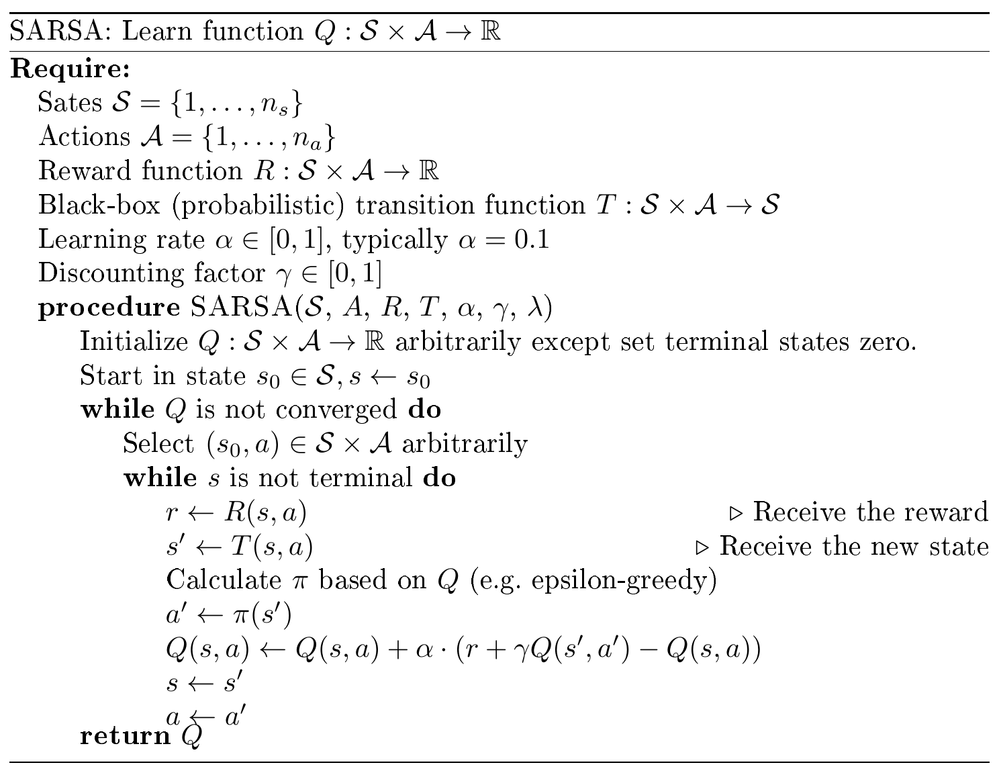


### 3.2 Q-learning

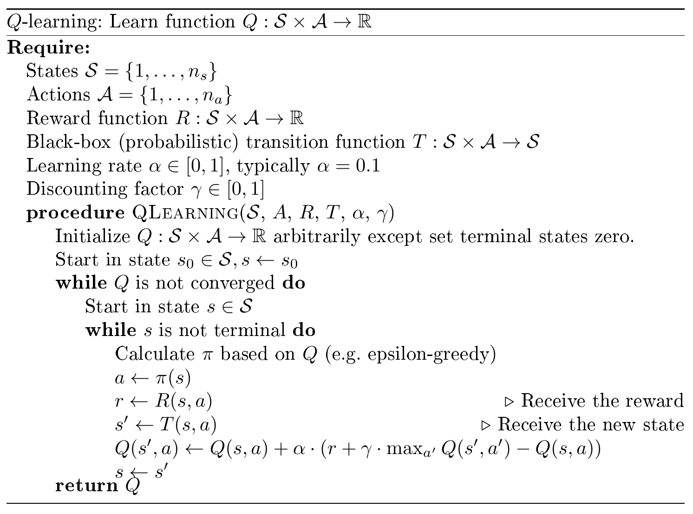


### 3.3 Expect-SARSA


* 注：特别的，这里 $\pi(a|s')$ 的计算在代码中如下实现：

  ```python
  best_actions = np.argwhere(q_next == np.max(q_next))
  for action_ in action_set:
      if action_ in best_actions:
          target += ((1.0 - epsilon) / len(best_actions) + epsilon / len(action_set)) 
          * q_value[next_state[0], next_state[1], action_]
      else:
          target += epsilon / len(action_set) 
          * q_value[next_state[0], next_state[1], action_]
  ```

  也就是说，当 $a\in\text{best\_actions of $s'$}$ 时，$\pi(a|s')=\dfrac{1-\epsilon}{|\text{best\_actions of $s'$}|}+\dfrac{\epsilon}{\text{action set}}$ ；否则有 $\pi(a|s')=\dfrac{\epsilon}{\text{action set}}$；


### 3.4 SARSA-lambda

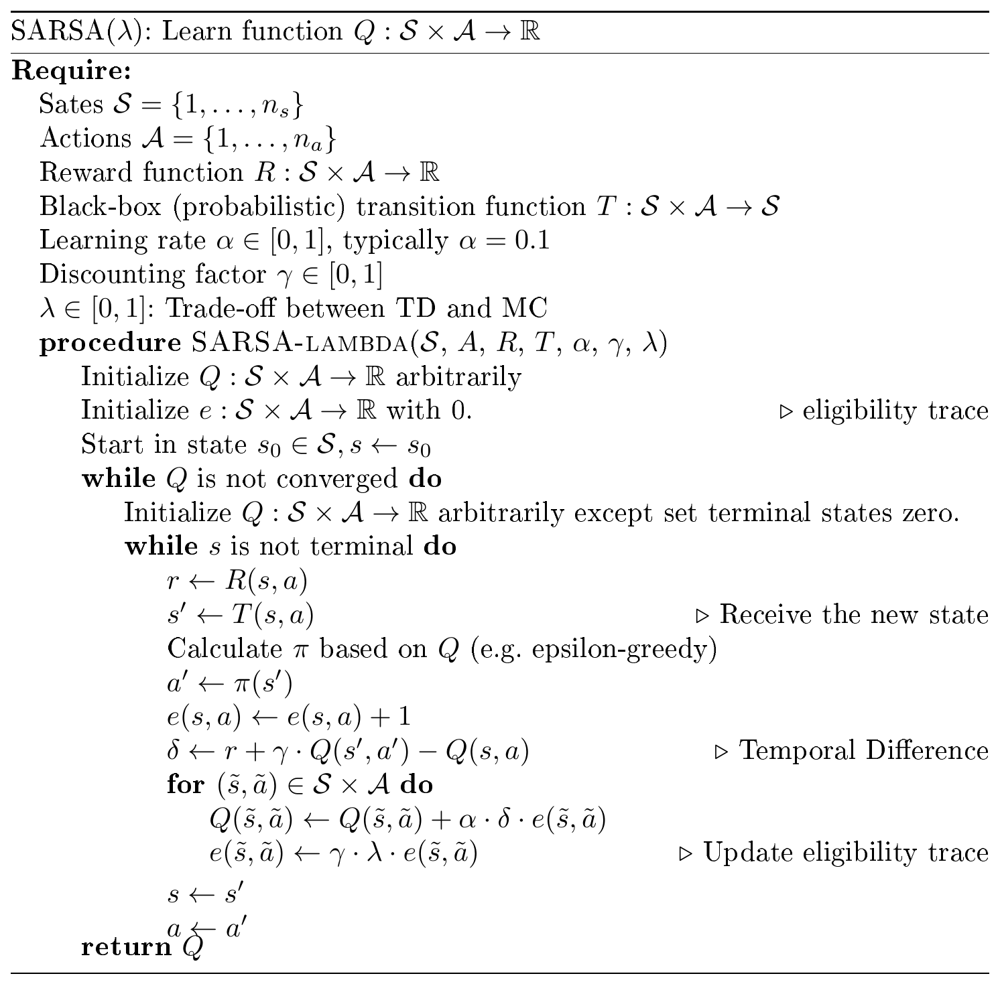


### 3.5 训练代码

* 在训练过程中，我们会记录每一次走到终点的路径和总共消耗的步数；
* 同时，为了保证最后算法向最优路径收敛，我们让 $\epsilon$ 随训练的 `episode` 增加而减少；
* 通过制定 `method` 参数可以指定训练方法，值得注意：每个方法都应该使用各自不同的 Q-table 来进行迭代‘

```python
while episode_index < EPISODE_NUM:
    # let the EPSILON vary when the time elapse
    var_EPSILON = EPSILON/(episode_index + 1)
    elapse, result_1 = one_episode(Q_VALUES_1, method = "SARSA", epsilon = var_EPSILON)
    sarsa_elapse.append(elapse)
    
    elapse, result_2 = one_episode(Q_VALUES_2, method = "Q-learning", epsilon = var_EPSILON)
    qlearning_elapse.append(elapse)
    
    elapse, result_3 = one_episode(Q_VALUES_3, method = "Expect-SARSA", epsilon = var_EPSILON)
    Esarsa_elapse.append(elapse)
    
    elapse, result_4 = one_episode(Q_VALUES_4, method = "SARSA-lambda", epsilon = var_EPSILON)
    sarsaLambda_elapse.append(elapse)
    episode_index += 1
```


## 4. 结果陈述

### 4.1 概述

* 蓝色方块代表了算法所探索的路径，在训练过程中交互式界面会展示整个过程；

我们在这里展示最后一个算法 SARSA-lambda 所找到的最优路径。事实上，因为结果是收敛的，四个算法都能得到最优的路径。

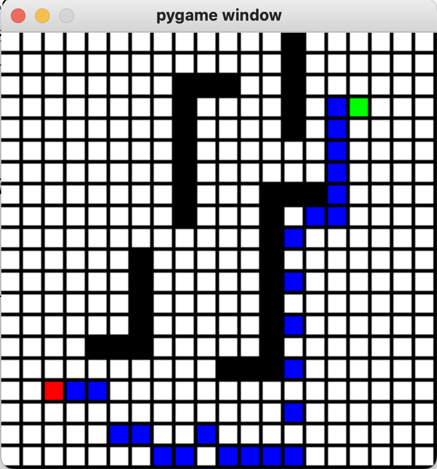

我们也可以打印这个路径的走法：此处略，见算法文档；


### 4.2 结果分析

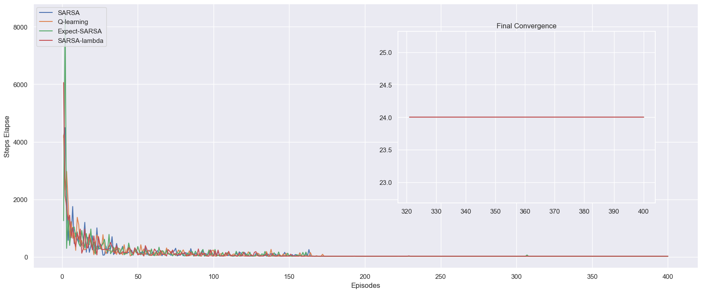

这幅图像向我们展示了400个 `episode` 中，每一个 `episode` 中为达到终点 `GOAL` 所消耗的步数。可以发现，实际上在175个 `episode` 之后，四个算法都达到了上述最优路径，也就是从起点 `START` 24步达到终点 `GOAL` 。为了更加清晰地比较算法优劣，我们将每一次训练的步长累积加和，得到下图：

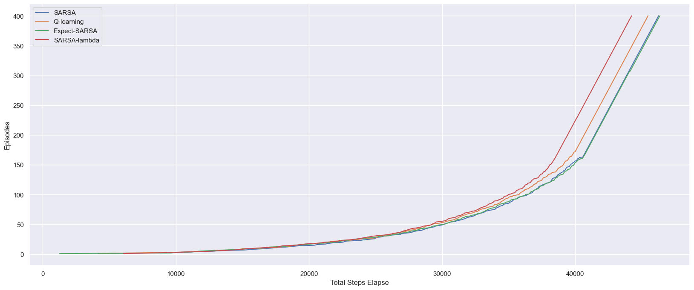

可以发现在上图中，在175个 `episode` 之后，四个算法的斜率保持平行，这是因为他们都找到了最优路径，这个斜率是24步/次训练。而比较发现， SARSA-lambda 算法的表现是最好的，它最快收敛到了最优路径，Q-learning 算法其次。而 SARSA 和 Expect-SARSA 算法表现接近，收敛速度相对不如前两者。


## 5. 拓展：更复杂的迷宫

### 5.1 环境

我们发现，由于纵向风的存在，算法非常容易通过“单向”操作（只要向下和向右/只要向上和向右）找到最优路径，为此我们设计了如下更复杂的迷宫来验证此时算法是否依然有效。


```python
Wind strength for each column is: 
['-2', '1', '-2', '-2', '0', '-1', '-1', '0', '1', '0', 
 						'1', '0', '-1', '-2', '-1', '1', '0', '-2', '0', '-2']
```


### 5.2 结果

可以发现四个算法还是找到了最优路径，不过事实上 Q-learning 算法的最优路径在最后几步与其他三个算法稍有不同。

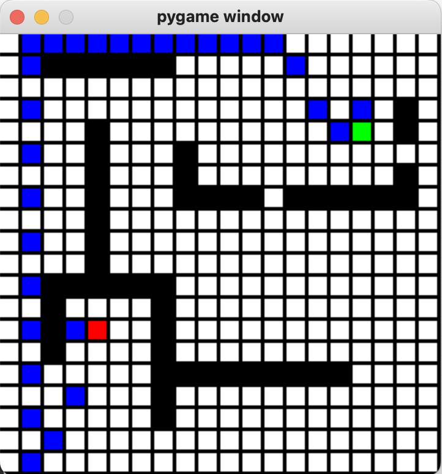

从分析图上来看，最优路径是30步。而在这个更加复杂的环境下，显然四个算法都用了更多的 `episode` 以达到最优。可以发现在最后的几次训练过程中 SARSA 算法仍然有相对较大的“毛刺”，这可能是因为 SARSA 和 Q-learning 对未来的探索性不如其他两个算法所致。

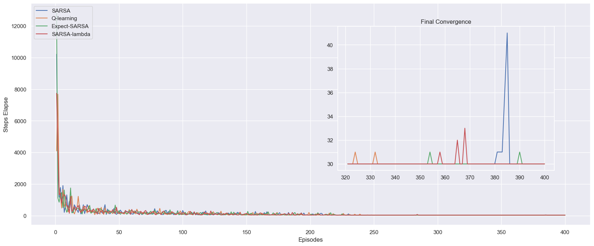

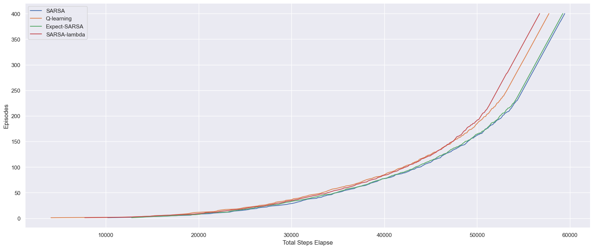

总体来看，我们的结论与之前相同：

>  SARSA-lambda 算法的表现是最好的，它最快收敛到了最优路径，Q-learning 算法其次。而 SARSA 和 Expect-SARSA 算法表现接近，收敛速度相对不如前两者。


## 6. 拓展：随机风向

### 6.1 环境

我们考虑如下环境设计，并启用随机风向：

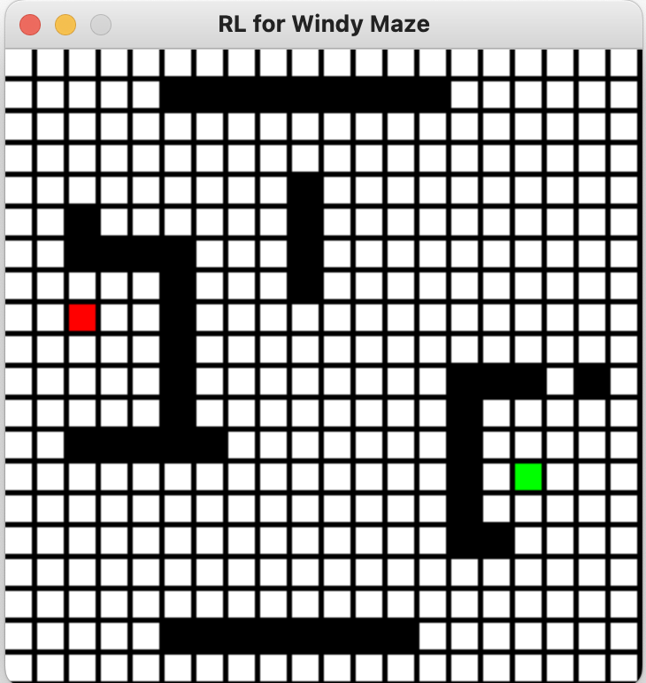

```python
world = enviroment_gen(HEIGHT,WIDTH,WIND,is_random = True)
```

特别的，此时的 `WIND` 不再生效，而被随机风向取代。


### 6.2 结果

注意，这里我们只是展示了算法 SARSA-lambda 最后一次迭代（训练）的结果，由于四个算法都并未收敛，所以实际上此条路径并非是最优的。不过由于风向是随机的，除了特定设计的迷宫，大部分情况下并不存在一条最优的路径。

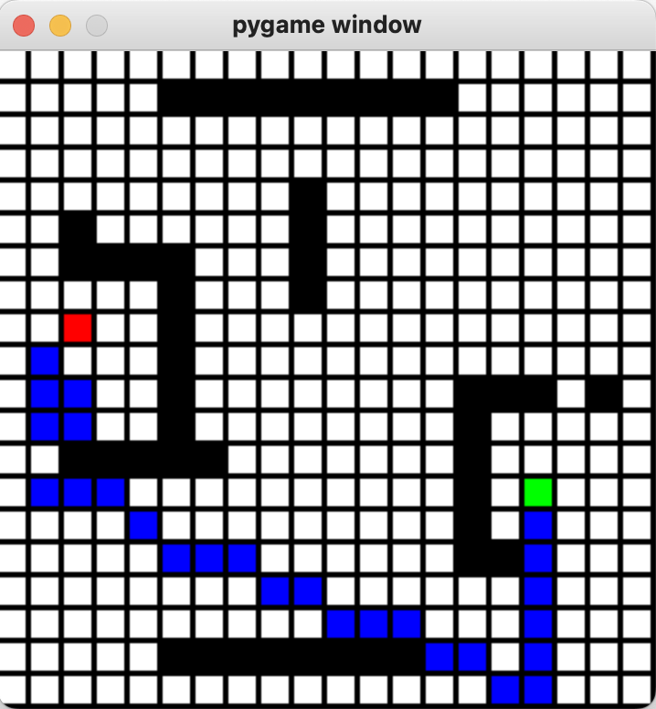

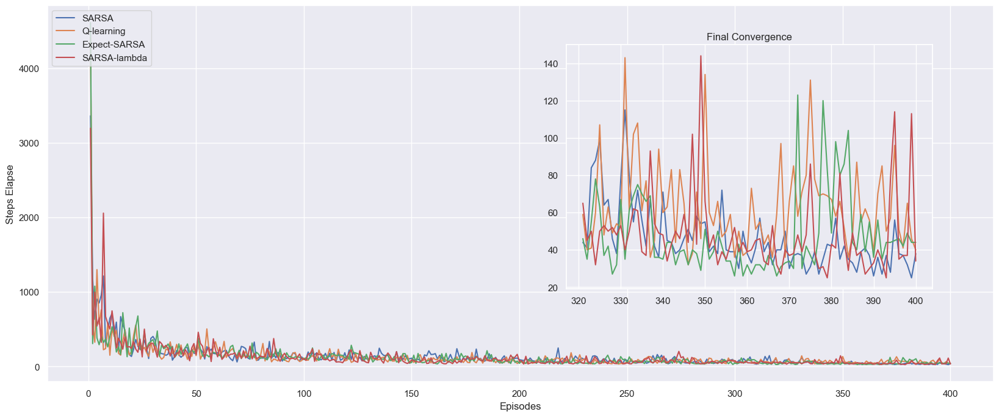


从上图我们也可以发现，此时并没有算法收敛，他们每次训练的步长都稳定在20至140步之间。而从总体上来看，除了 SARSA 算法表现显著较差以外，其他三个算法的表现是相近的。特别的，相比于之前的结论 Q-learning 算法似乎在随机风向的情况下有非常显著的提升。**但是，进一步的实验也证明了并不像风向固定的情况，四个算法在随机风向的情况下的表现优劣并不是固定的。**


### 6.3 特殊迷宫

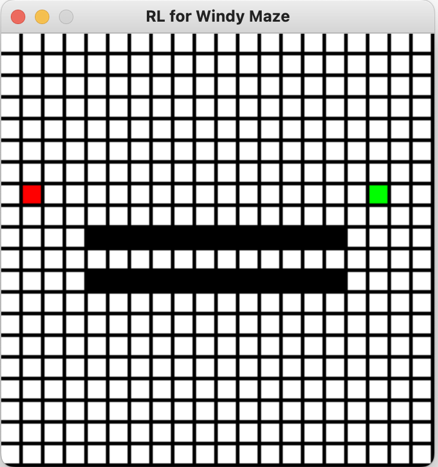

我们设计此地图的原意是想让算法经过迭代发现通过两侧障碍物间的通道以得到一个不受随机风向影响的固定步长。不过，虽然最终的结果（下图）与我们的预期有所差异，但是算法确实发现了可以利用地形来减少风向随机性带来的影响。

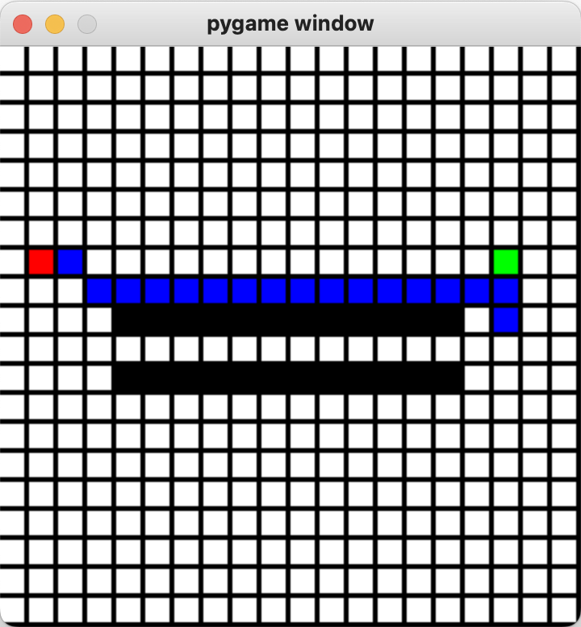

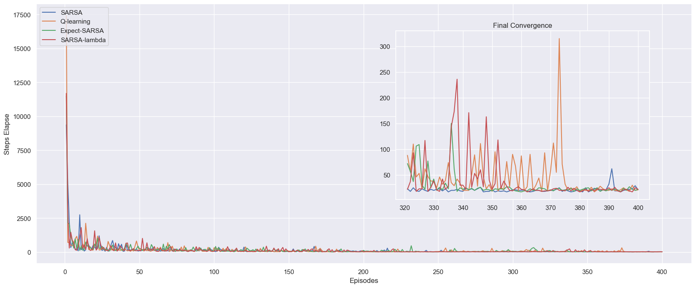

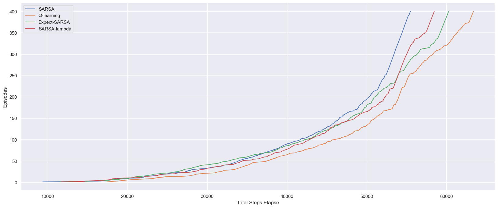

通过上述分析图我们可以发现，相比于之前的情况，在这张被特殊设计的迷宫中四个算法在400个 `episode` 训练后趋向于收敛。特别是 SARSA 算法在经过约250次训练后，其第二幅图像中的曲线就趋向于一条直线（这表明每次训练都得到了固定步长，趋向于最优路径）。但是，我们也发现此时算法的优劣性与我们之前的结论完全不同，这里的 SARSA 算法表现最好（累计步长少）而 Q-learning 却表现显著更差。因此，我们认为在随机风向的情况下，我们很难断言何种算法会有更好的表现。


## 7. 程序附录

### 7.1 环境设计

```python
import numpy as np
import matplotlib
import matplotlib.pyplot as plt
import random
import pygame as pg
import seaborn as sns
sns.set()

class enviroment_gen():
    def __init__(self, height : int, width : int, wind : list, is_random: bool = False):
        """
        Generate a simulating environment.

        :param height: Maze Height;
        :param width: Maze WIDTH;
        :param wind: Winds list along the columns, hence its length should be WIDTH;
        :param is_random: whether the wind is random;
        """
        self.HEIGHT = height
        self.WIDTH = width
        self.WIND = wind
        self.is_random = is_random
        
        # must set valid wind list
        if len(self.WIND) != self.WIDTH:
            self.WIND = [0] * self.WIDTH # reset it to zero
            print("Notice: Given wrong wind list, reset to zero!")
        
        # get the environment matrix and display winodw
        self.__maze = self.visualize()

        # possible actions
        self.ACTION_UP = 0
        self.ACTION_DOWN = 1
        self.ACTION_LEFT = 2
        self.ACTION_RIGHT = 3

    def step(self, state : list, action : int):
        """
        Generate next state based on current state and action.
        Notice that the wind affect should be based on current state, not next-state.
        Tips: we make sure that the agent will not pass-through the wall by `step(state,action)`.

        :param state: current state;
        :param action: action choosen;
        :return: next state (a (2,1) list);
        """
        i, j = state
        # notice: the left corner is [0,0] and the right corner is [HEIGHT - 1, WIDTH - 1]
        if self.__maze[i,j] == -10: # you can't get to a wall state
            print("Something went wrong!")
            print(i,j)
            assert False
        
        if self.is_random:
            self.WIND[j] = np.random.choice(2,1) -1
        if action == self.ACTION_UP:
            end = min(max(i - 1 - self.WIND[j], 0), self.HEIGHT - 1)
            if end <= i:
                if np.any(self.__maze[end:i + 1, j] == -10):
                    end += np.where(self.__maze[end:i + 1, j] == -10)[0][-1]
                    return [min(end + 1, i), j]
                else:
                    return [end,j]
            else:
                if np.any(self.__maze[i:end + 1, j] == -10):
                    end = i + np.where(self.__maze[i:end + 1, j] == -10)[0][0]
                    return [max(end - 1, i), j]
                else:
                    return [end,j]
        
        elif action == self.ACTION_DOWN:
            end = max(min(i + 1 - self.WIND[j], self.HEIGHT - 1), 0)
            if end >= i:
                if np.any(self.__maze[i:end + 1, j] == -10):
                    end = i + np.where(self.__maze[i:end + 1, j] == -10)[0][0]
                    return [max(end - 1, i), j]
                else:
                    return [end, j]
            else:
                if np.any(self.__maze[end:i + 1, j] == -10):
                    end += np.where(self.__maze[end:i + 1, j] == -10)[0][-1]
                    return [min(end + 1, i), j]
                else:
                    return [end, j]
        
        elif action == self.ACTION_LEFT:
            if self.__maze[i, max(j - 1, 0)] == -10:
                return [i, j]
            end = min(max(i - self.WIND[j], 0), self.HEIGHT - 1)
            if end <= i:
                if np.any(self.__maze[end:i + 1, max(j - 1, 0)] == -10):
                    end += np.where(self.__maze[end:i + 1, max(j - 1, 0)] == -10)[0][-1]
                    return [min(end + 1, i), max(j - 1, 0)]
                else:
                    return [end, max(j - 1, 0)]
            else:
                if np.any(self.__maze[i:end + 1, max(j - 1, 0)] == -10):
                    end = i + np.where(self.__maze[i:end + 1, max(j - 1, 0)] == -10)[0][0]
                    return [max(end - 1, i), max(j - 1, 0)]
                else:
                    return [end, max(j - 1, 0)]
        
        elif action == self.ACTION_RIGHT:
            if self.__maze[i, min(j + 1, self.WIDTH - 1)] == -10:
                return [i, j]
            end = min(max(i - self.WIND[j], 0), self.HEIGHT - 1)
            if end <= i:
                if np.any(self.__maze[end:i + 1, min(j + 1, self.WIDTH - 1)] == -10):
                    end += np.where(self.__maze[end:i + 1, min(j + 1, self.WIDTH - 1)] == -10)[0][-1]
                    return [min(end + 1, i), min(j + 1, self.WIDTH - 1)]
                else:
                    return [end, min(j + 1, self.WIDTH - 1)]
            else:
                if np.any(self.__maze[i:end + 1, min(j + 1, self.WIDTH - 1)] == -10):
                    end = i + np.where(self.__maze[i:end + 1, min(j + 1, self.WIDTH - 1)] == -10)[0][0]
                    return [max(end - 1, i), min(j + 1, self.WIDTH - 1)]
                else:
                    return [end, min(j + 1, self.WIDTH - 1)]
        else:
            assert False
    
    def visualize(self):
        """
        Generate the MAZE. 使用说明:
        1. 按下鼠标左键设置起点;
        2. 按下鼠标右键设置终点;
        3. 鼠标滚轮上滑设置路径;
        4. 鼠标滚轮下滑设置墙(障碍物);

        :return: Matrix form of the `maze` environment;
        """
        # set width and height of UI window
        window_height = self.HEIGHT*18
        window_width = self.WIDTH*18

        # initialize PyGame
        pg.init()

        # create PyGame window
        win = pg.display.set_mode((window_width,window_height))
        pg.display.set_caption("RL for Windy Maze")

        # set drawable dimensions of each cell
        width_ = 15
        margin_ = 3

        # set drawable objects
        maze = [[-1 for _ in range(0, self.WIDTH)]
                for _ in range(0, self.HEIGHT)]
        grid = np.array(maze)

        # initialize loop for customizing maze grid
        setup = True
        self.update(grid, win, width_, margin_)
        while setup:
            for event in pg.event.get():
                if event.type == pg.QUIT:
                    setup = False
                    pg.display.quit()
                    pg.quit()
                
                # take user input for drawing game environment
                elif event.type == pg.MOUSEBUTTONDOWN:
                    pos = pg.mouse.get_pos()
                    column = pos[0] // (width_ + margin_)
                    row = pos[1] // (width_ + margin_)
                    if event.button == 1: # 按下鼠标左键设置起点
                        grid[row, column] = 0
                    if event.button == 3: # 按下鼠标右键设置终点
                        grid[row, column] = 10
                    if event.button == 4: # 鼠标滚轮上滑设置路径
                        grid[row, column] = -1
                    if event.button == 5: # 鼠标滚轮下滑设置墙(障碍物)
                        grid[row, column] = -10
                    self.update(grid, win, width_, margin_)
        
        assert len(np.where(grid == 0)[0]) == 1
        assert len(np.where(grid == 10)[0]) == 1
        return grid
    
    def update(self, grid, win, width_ : int, margin_ : int):
        """
        Visualize current MAZE based on `grid` and export it to `win`.

        width_ and margin_ should be constant.
        """
        for row in range(len(grid)):
            for column in range(len(grid[row])):
                # draw cells occupied by walls
                if grid[row, column] == -10:
                    pg.draw.rect(win, pg.Color("BLACK"), 
                                 ((width_ + margin_) * column, 
                                  (width_ + margin_) * row,
                                  width_, width_))
                # draw empty cells
                if grid[row, column] == -1:
                    pg.draw.rect(win, pg.Color("White"), 
                                 ((width_ + margin_) * column, 
                                  (width_ + margin_) * row, 
                                  width_, width_))
                # draw cells occupied by the end goal
                if grid[row, column] == 10:
                    pg.draw.rect(win, pg.Color("Green"), 
                                 ((width_ + margin_) * column, 
                                  (width_ + margin_) * row, 
                                  width_, width_))
                # draw cells occupied by the path finder
                if grid[row, column] == 2:
                    pg.draw.rect(win, pg.Color("Blue"), 
                                 ((width_ + margin_) * column, 
                                  (width_ + margin_) * row, 
                                  width_, width_))
                # Draw cells occupied by the starter
                if grid[row, column] == 0:
                    pg.draw.rect(win, pg.Color("RED"), 
                                 ((width_ + margin_) * column, 
                                  (width_ + margin_) * row, 
                                  width_, width_))
        pg.display.update()

    @property
    def maze(self):
        # forbid any outer to change maze
        return self.__maze

# world height
HEIGHT = 20

# world width
WIDTH = 20

# wind strength for each column
WIND = np.random.choice(4,WIDTH) -2 # 当风的强度小于0时候表示反向风
#WIND = [0, 0, 0, 1, 1, 1, 2, 2, 1, 0] # most trival case
print(f"Wind strength for each column is:\n{[str(w) for w in WIND]}")

# 环境编号: 路径 = -1 / 墙体 = -10 / 起点 = 0 / 终点 = 10 / 预留可视化 = 2
world = enviroment_gen(HEIGHT,WIDTH,WIND,is_random = True)
```


### 7.2 训练和结果输出

```python
# initialize PyGame
pg.init()
# create PyGame window (18 is the size of cells and hence constant)
WIN = pg.display.set_mode((world.WIDTH*18,world.HEIGHT*18))
pg.display.set_caption("RL for Windy Maze")

MAZE = world.maze # MAZE must not be changed
MAZE_show = MAZE.copy() # copy for visualzing our path
world.update(MAZE, WIN, 15, 3)
START = [np.where(MAZE == 0)[0][0], np.where(MAZE == 0)[1][0]]
GOAL = [np.where(MAZE == 10)[0][0], np.where(MAZE == 10)[1][0]]
WALLS = [[np.where(MAZE == -10)[0][i],np.where(MAZE == -10)[1][i]] 
         for i in range(len(np.where(MAZE == -10)[0])) ]
ACTIONS = [world.ACTION_UP, world.ACTION_DOWN, world.ACTION_LEFT, world.ACTION_RIGHT]

# probability for exploration (epsilon greedy)
EPSILON = 0.1
# step-size
ALPHA = 0.5
# reward for each step
REWARD = -1.0
# parameter for SARSA-lambda
LAMBDA = 0.05

def choose_action(state: list, q_value : np.ndarray, e
                  psilon : float = EPSILON, action_set : list = ACTIONS):
    """
    choose an action based on epsilon-greedy algorithm

    :param state: current state;
    :param q_value: reference Q-table for updating;
    :param epsilon: probability for exploration;
    :param action_set: actions can be choosen from;
    
    :return: action to be choosed.
    """
    if np.random.binomial(1, epsilon) == 1:
        return np.random.choice(action_set)
    else:
        values_ = q_value[state[0], state[1], :]
        return np.random.choice(
          [action_ for action_, value_ in enumerate(values_) 
           if value_ == np.max(values_)])

def one_episode(q_value : np.ndarray, method : str = "SARSA", 
                epsilon : float = EPSILON, alpha : float = ALPHA, 
                lambda_: float = LAMBDA,
                reward : float = REWARD, action_set : list = ACTIONS, 
                start : list = START, goal : list = GOAL):
    """
    Play one episode game based on q_value.
    Notice this function will change q_value!

    :param q_value: current Q-table;
    :param method: method to be used;
    :param epsilon: probability for exploration;
    :param alpha: alpha ratio for updating rule, also known as step-size;
    :param lambda_: parameter for SARSA-lambda algorithm;
    :param reward: reward for each step, assumed fixed;
    :param action_set: actions can be choosen from;
    :param start: state for start;
    :param goal: state for goal;
    
    :return: how many times it takes from START to GOAL.
    :return: the action path.
    """
    # declare global settings for visualize
    global MAZE_show, MAZE, WIN, world
    assert method in ["SARSA", "Q-learning", "Expect-SARSA","SARSA-lambda"]

    # initialize state
    state = start
    state_path = []

    action = choose_action(state, q_value, epsilon, action_set)
    action_path = []

    if method == "SARSA-lambda":
        trace = np.zeros((world.HEIGHT, world.WIDTH, 4))  
        # Eligibility Trace Initialize

    # keep going until get to the goal state
    while state != goal:
        if method == "SARSA":
            next_state = world.step(state, action)
            #print(state, action, next_state)
            next_action = choose_action(next_state, q_value, epsilon, action_set)
            target = q_value[next_state[0], next_state[1], next_action]

        elif method == "Q-learning":
            action = choose_action(state, q_value, epsilon, action_set) 
            # action based on current state
            next_state = world.step(state, action)
            target = np.max(q_value[next_state[0], next_state[1], :])

        elif method == "Expect-SARSA":
            next_state = world.step(state, action)
            next_action = choose_action(next_state, q_value, epsilon, action_set)
            # calculate the expected value of new state
            target = 0.
            q_next = q_value[next_state[0], next_state[1], :]
            best_actions = np.argwhere(q_next == np.max(q_next))
            for action_ in action_set:
                if action_ in best_actions:
                    target += ((1.0 - epsilon) / len(best_actions) 
                               + epsilon / len(action_set)) 
                    * q_value[next_state[0], next_state[1], action_]
                else:
                    target += epsilon / len(action_set) 
                    * q_value[next_state[0], next_state[1], action_]
            
        elif method == "SARSA-lambda":
            next_state = world.step(state, action)
            next_action = choose_action(next_state, q_value, epsilon, action_set)
            target = q_value[next_state[0], next_state[1], next_action]

            delta = reward + target  - q_value[state[0], state[1], action]
            # Update Eligibility Trace
            trace[state[0], state[1], action] += 1

            # Update Rule (Eligibility Trace Form)
            # Notice that the REWARD is fixed (= -1) !
            q_value += alpha * delta * trace
            trace *= lambda_
        
        # Update Rule (TD form)
        # Notice that the REWARD is fixed (= -1) !
        # Notice that the Eligibility Trace is updated in another way!
        if method != "SARSA-lambda":
            q_value[state[0], state[1], action] += \
                alpha * (reward + target  - q_value[state[0], state[1], action])
        
        # store actions and states
        state = next_state
        state_path.append(next_state)
        action_path.append(action)
        if method != "Q-learning":
            action = next_action

    # color the cells to illustrate path (visualize)
    MAZE_show = MAZE.copy()
    for i in state_path[:-1]:
        MAZE_show[i[0], i[1]] = 2
    world.update(MAZE_show, WIN, 15, 3)

    return len(action_path), action_path

def Main(EPISODE_NUM : int = 400):
    """
    Main function.

    :param EPISODE_NUM: Run the MAZE learning for EPISODE_NUM times;
    :return: the action path of each given metho.
    """
    global MAZE_show, MAZE, WIN, world
    global START, GOAL, WALLS, ACTIONS
    global EPSILON, ALPHA, REWARD

    # setup Q-tables and total episode num
    HEIGHT, WIDTH = world.HEIGHT, world.WIDTH
    Q_VALUES_1 = np.zeros((HEIGHT, WIDTH, 4))
    Q_VALUES_2 = np.zeros((HEIGHT, WIDTH, 4))
    Q_VALUES_3 = np.zeros((HEIGHT, WIDTH, 4))
    Q_VALUES_4 = np.zeros((HEIGHT, WIDTH, 4))

    sarsa_elapse = []
    qlearning_elapse = []
    Esarsa_elapse = []
    sarsaLambda_elapse = []
    result_1, result_2, result_3, result_4 = None, None, None, None
    episode_index = 0

    while episode_index < EPISODE_NUM:
        # let the EPSILON vary when the time elapse
        var_EPSILON = EPSILON/(episode_index + 1)
        elapse, result_1 = one_episode(Q_VALUES_1, method = "SARSA", 
                                       epsilon = var_EPSILON)
        sarsa_elapse.append(elapse)
        elapse, result_2 = one_episode(Q_VALUES_2, method = "Q-learning", 
                                       epsilon = var_EPSILON)
        qlearning_elapse.append(elapse)
        elapse, result_3 = one_episode(Q_VALUES_3, method = "Expect-SARSA", 
                                       epsilon = var_EPSILON)
        Esarsa_elapse.append(elapse)
        elapse, result_4 = one_episode(Q_VALUES_4, method = "SARSA-lambda", 
                                       epsilon = var_EPSILON)
        sarsaLambda_elapse.append(elapse)
        episode_index += 1
    
    #pg.display.quit()
    #pg.quit()
    
    plt.figure(figsize = (20,8))
    treshold = int(0.2 * EPISODE_NUM)
    plt.plot(np.arange(1, EPISODE_NUM + 1),sarsa_elapse, label = "SARSA")
    plt.plot(np.arange(1, EPISODE_NUM + 1),qlearning_elapse, label = "Q-learning")
    plt.plot(np.arange(1, EPISODE_NUM + 1),Esarsa_elapse, label = "Expect-SARSA")
    plt.plot(np.arange(1, EPISODE_NUM + 1),sarsaLambda_elapse, label = "SARSA-lambda")

    plt.xlabel('Episodes')
    plt.ylabel('Steps Elapse')
    plt.legend(loc = 2)

    axes = plt.axes([0.55, 0.3, 0.3, 0.5])
    plt.title('Final Convergence')
    plt.plot(np.arange(1, EPISODE_NUM + 1)[-treshold:], sarsa_elapse[-treshold:])
    plt.plot(np.arange(1, EPISODE_NUM + 1)[-treshold:], qlearning_elapse[-treshold:])
    plt.plot(np.arange(1, EPISODE_NUM + 1)[-treshold:], Esarsa_elapse[-treshold:])
    plt.plot(np.arange(1, EPISODE_NUM + 1)[-treshold:], sarsaLambda_elapse[-treshold:])
    #plt.setp(axes)
    plt.show()
    
    plt.figure(figsize = (20,8))
    sarsa_elapse = np.add.accumulate(sarsa_elapse)
    qlearning_elapse = np.add.accumulate(qlearning_elapse)
    Esarsa_elapse = np.add.accumulate(Esarsa_elapse)
    sarsaLambda_elapse = np.add.accumulate(sarsaLambda_elapse)
    plt.plot(sarsa_elapse, np.arange(1, EPISODE_NUM + 1),label = "SARSA")
    plt.plot(qlearning_elapse, np.arange(1, EPISODE_NUM + 1), label = "Q-learning")
    plt.plot(Esarsa_elapse, np.arange(1, EPISODE_NUM + 1), label = "Expect-SARSA")
    plt.plot(sarsaLambda_elapse, np.arange(1, EPISODE_NUM + 1), label = "SARSA-lambda")

    plt.xlabel('Total Steps Elapse')
    plt.ylabel('Episodes')
    plt.legend()
    plt.show()

    # display the optimal policy
    fianl_policy = []
    for i in range(0, HEIGHT):
        fianl_policy.append([])
        for j in range(0, WIDTH):
            if [i, j] == GOAL:
                fianl_policy[-1].append('G')
                continue
            elif [i,j] in WALLS:
                fianl_policy[-1].append('X')
                continue
            
            best_action = np.argmax(Q_VALUES_4[i, j, :]) 
            # show the best policy for SARSA method
            if best_action == world.ACTION_UP:
                fianl_policy[-1].append('U')
            elif best_action == world.ACTION_DOWN:
                fianl_policy[-1].append('D')
            elif best_action == world.ACTION_LEFT:
                fianl_policy[-1].append('L')
            elif best_action == world.ACTION_RIGHT:
                fianl_policy[-1].append('R')
    print("THe optimal last policy is:")
    for row in fianl_policy:
        print(row)
    return result_1,result_2, result_3, result_4

result_1,result_2, result_3, result_4 = Main(EPISODE_NUM = 400)
```

